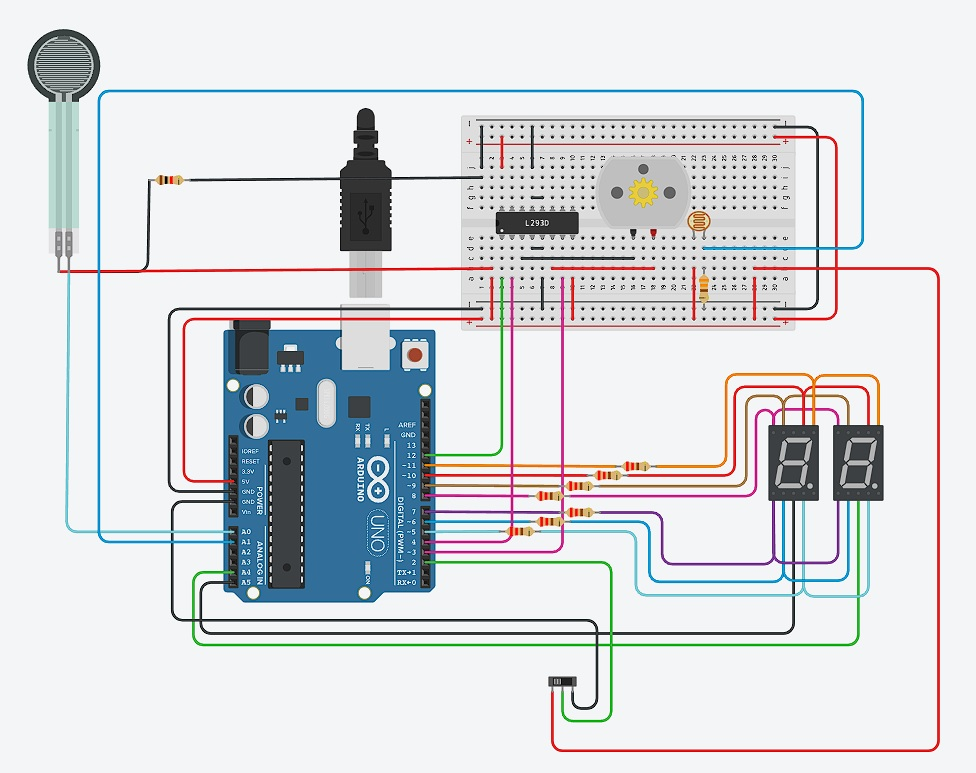

# Integrantes

 - Julian Ferreira.

# Proyecto contador lineal y de numero primos.





## Descripcion

Este proyecto consta de un contador de numeros que va del 0 al 99. El mismo utiliza multiplexacion para poder utilizar dos displays de 7 segmentos. El usuario tiene un switch el cual cuando este esta para la izquierda, el contador avanzara mostrando una sucesion de numeros primos, por otra parte si el switch esta a la derecha mostrar una sucesion continua de numero.  Tambien cuenta con un motor que utiliza un puente H, esto permite que cuando el switch se encuentre para la izquierda el motor gire para ese lado y cuando el switch se encuentre en el lado derecho gire para ese mismo lado. Se agrego tambien Un sensor de fuerza, que a mayor fuerza que se le aplique el contado avanzara mas rapido. 
En esta nueva version se agrego tambien un fotosensor, que apartir de la intensidad de luz que este reciba determinara si detener el contador y el motor. La detencion del funcionamiento se dara cuando la luz que reciba sea alta.

## Funcionamiento
Estas son las principales funciones que encontramos en el proyecto. La funcion esPrimo() se utiliza en el contador de numeros primos para poder definir si el numero que llega es primo y por lo tanto debe ser mostrado. Luego esta la funcion determineVelocity() que apartir de recibir como parametro la fuerza que se le esta ejerciendo al sensor, esta determina la velocidad de cambio de los numeros si debe ser mas rapido o mas lento. turnRight() y turnLeft() sirven para determinar la direccion de giro del motor. Para poder tener una lectura mas lineal del sensor de fuerza, utilizamos la funcion map(). En esta parte del proyecto decidi encerrar la logica del switch en la funcion switchSelection(), para hacer el codigo mas legible. Se utilizo para poder conseguir los valores de fotoresistor la funcion map(), permitiendo definir que apartir de cierto valor de intensidad de luz (en este caso el valor seria 8 o mas) cuando no ejecutar mas las funcion del contador o del motor.

```  
void loop()
{
  lecturaSensor = analogRead(SENSOR);
  int fuerza = map(lecturaSensor,0,466,0.0,10.0);
  determineVelocity(fuerza);
  
  int photoSensor = analogRead(PHOTORESISTOR);
  int intensidad = map(photoSensor, 2, 404, 0, 10);
  
  int value = digitalRead(slideSwitch);
  
  if(intensidad < 8){
    if (lastUpdateTime >= velocity) {
      switchSelection(value);
      lastUpdateTime = 0;
    } else {
      lastUpdateTime++;
    }
  }
  printCount(cuenta);
  
}

void switchSelection(int value){
  if (value == 0) {
      turnRight();
      cuenta++;
      if (cuenta > 99) {
        cuenta = 0;
      }
    } else {
      turnLeft();
      cuenta++;
      if (cuenta > 99) {
        cuenta = 0;
      }
      while (!esPrimo(cuenta)) {
        cuenta++;
        if (cuenta > 99) {
          cuenta = 0;
        }
      }
    }
}

void turnLeft(){
	digitalWrite(input1, HIGH);
    digitalWrite(input2, LOW);
}

void turnRight(){
	digitalWrite(input1, LOW);
    digitalWrite(input2, HIGH);
}

void determineVelocity(int fuerza){
  if(fuerza >= 0 && fuerza <= 3){
  	velocity = 60;
  }
  else if(fuerza >= 4 && fuerza <= 7){
  	velocity = 30;
  }
  else{
  	velocity = 20;
  }
} 

bool esPrimo(int numero) {
  if (numero == 0 || numero == 1 || numero == 4) return false;
  for (int x = 2; x < numero / 2; x++) {
    if (numero % x == 0) return false;
  }
  return true;
}


```

## Link de las partes del proyecto
- [Proyecto tinkecad parte 1](https://www.tinkercad.com/things/5iz93c2jmh9-parcial-parte-1-/editel?sharecode=QYWzCuwdfJBvA7Sbo7mJ39WblqAxKO_rH9pPV3BmdcY)

- [Proyecto tinkecad parte 2](https://www.tinkercad.com/things/4WsAZ39J9mx-parcial-parte-dos-motor-cc/editel?sharecode=8F4m-_ncoo5xw4Oo_pIDOFmKIaGpHZ14in-CZYM6J4E)

- [Proyecto tinkecad parte 3](https://www.tinkercad.com/things/fxGgdQlLDHN-parcial-parte-3-photosensor/editel?sharecode=2fp5FJucLjon-CXGVpUcdDVpAdQ1aZ7dbHe1IsnopFg)
